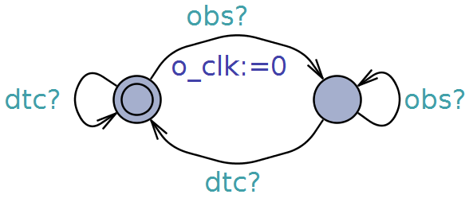
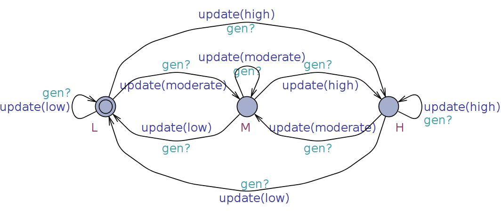

# SEAMS 2018

## Folder Content

The file ´model.xml´ contains the UPPAAL model for the real-time BSN application developed on OpenDaVINCIs framework.

## The BSN model in UPPAAL

The model consists of timed automata designed in UPPAAL semantics in order to express and assure the desired behavior through model checking. It contains three templates that fulfills the systems behavior: (i) scheduler (ii) bodyhub and (iii) sensornode. Also, an observer and a markov chain were implemented, the first for relevant properties verification and the second for generating input data for the model.
 
### Scheduler

The scheduler is responsible for controlling the distributed system modules within the time constraints. It has three locations: (i) idle, (ii) select and (iii) schedule. Following the First-Come-First-Served (FCFS) scheduling algorithm, aware of the instanced modules, the scheduler commmands its execution through the channels start[m]! and finish[m]?, constrained by a maximum period (PD) computated by its clock (g_clk). The guard variable 'done' permits or not the next module execution to avoid stack overflows as it is aware of instanced modules number.

### Operational Modules

Responsible for operationalizing the systems behavior, the BodyHub and SensorNodes were designed regarding the OpenDaVINCI's FCFS scheduling behavior, where each module fulfills a basic lifecycle represented by the locations wait, run and idle, and specializes its execution to encompass the tasks fulfillment with respect to each specific behavior. Note that each module has an internal clock i\_clk mainly used to compute the module computation time Cb (BodyHub) or Cs (Sensor Node). As for the specific logical behavior, the tasks were designed as committed locations following the left to right flow execution rule, where the sensor node comprises the tasks T1.1 (Collect sensor data) and T3 (Adjust sampling rate), in accordance with the controller activity, and the BodyHub is responsible for the tasks T1.3 (Persist data) and T2 (Analyze vital signal) through its decompositions T2.1 (Process sensor data) and T2.2 (Detect patient status). For procedure's code please consult the model file 'model.xml'.

### BodyHub

The BodyHub is an information centralizer, responsible for emergency detection and data persistence for future analisis. When triggered, the module checks for the arrival of messages containing active sensors' through the procedure isEmpty() that returns true or false wheter the messages buffer is empty or not. If not, a set of procedures is progressively executed performing the programmed actions encompassing (i) process received data (none -> processed), (ii) analyze actual status to detect or not an emergency (processed -> detected) and (iii) persist actual health status (detected -> persisted). In the end the update() procedure resets variables to avoid side effects.

 

### SensorNode

The SensorNode is responsible for collecting physiological information from the patient, pre-process and send it to the central node (e.g. BodyHub). As we proposed ourselves to automatize its behavior towards energy sufficiency optimization, a controller procedure was implemented and the locations 'ready' and 'done' has contributed to the model checking. When triggered, the controller procedure may permit or not the module's execution by setting the guard 'exe' true or not. When permitted (ready -> collected), the collect() procedure gathers a new sensor status (randomly generated by the Data Generator automaton) and sends it (collected -> sent), by inserting in the BodyHub's buffer.

### Observer

The Observer plays an important role regarding the properties verification. It is responsible for counting the elapsed time from when the SensorNode actually collects a high status data until the BodyHub detects it through cnannels 'obs' and 'dtc'.  

 

### Data Generator

The Data Generator consists of an automaton that randomly generates a new sensor status when triggered by the channel 'gen' by setting the guard sn\_status 'low', 'moderate' or 'high' through the update('status') procedure.

