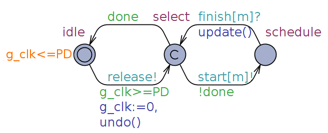
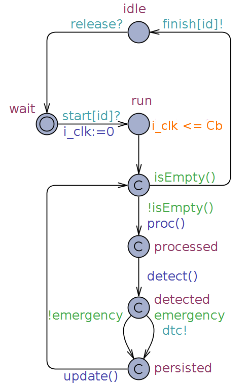
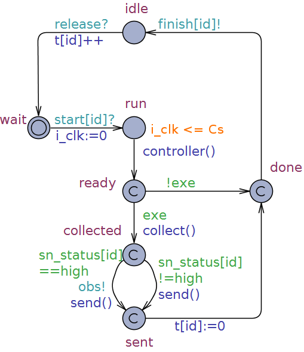

# SEAMS 2018

## Folder Content

The file ´model.xml´ contains the UPPAAL model for the real-time BSN application developed on OpenDaVINCIs framework.

## The BSN model in UPPAAL

The model consists of timed automata designed in UPPAAL semantics in order to express and assure the desired behaviour through model checking. It contains three templates that fulfills the systems behaviour: (i) scheduler (ii) bodyhub and (iii) sensornode. Also, an observer and a markov chain were implemented, the first for relevant properties verification and the second for generating input data for the model.
 
### Scheduler

The scheduler is responsible for controlling the distributed system modules within the time constraints. It has three locations: (i) idle, (ii) select and (iii) schedule. Following the First-Come-First-Served (FCFS) scheduling algorithm, aware of the instanced modules, the scheduler commmands its execution through the channels start[m]! and finish[m]?, constrained by a maximum period (PD) computated by its clock (g_clk). The guard variable 'done' permits or not the next module execution to avoid stack overflows as it is aware of instanced modules number.

### Operational Modules

Responsible for operationalizing the systems behaviour, the BodyHub and SensorNodes were designed regarding the FCFS scheduling behaviour, where each module fulfills a basic lifecycle represented by the locations wait, run and idle, and specializes its execution to encompass the tasks fulfillment with respect to each specific behaviour. Note that each module has an internal clock i\_clk mainly used to compute the module computation time Cb (BodyHub) or Cs (Sensor Node). As for the specific logical behaviour, the tasks were designed as committed locations following the left to right flow execution rule, where the sensor node comprises the tasks T1.1 (Collect sensor data) and T3 (Adjust sampling rate), in accordance with the controller activity, and the BodyHub is responsible for the tasks T1.3 (Persist data) and T2 (Analyze vital signal) through its decompositions T2.1 (Process sensor data) and T2.2 (Detect patient status). For procedure's code please consult the model file 'model.xml'.

### BodyHub

 

### SensorNode

